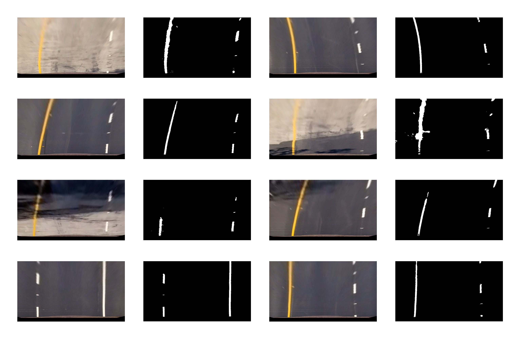
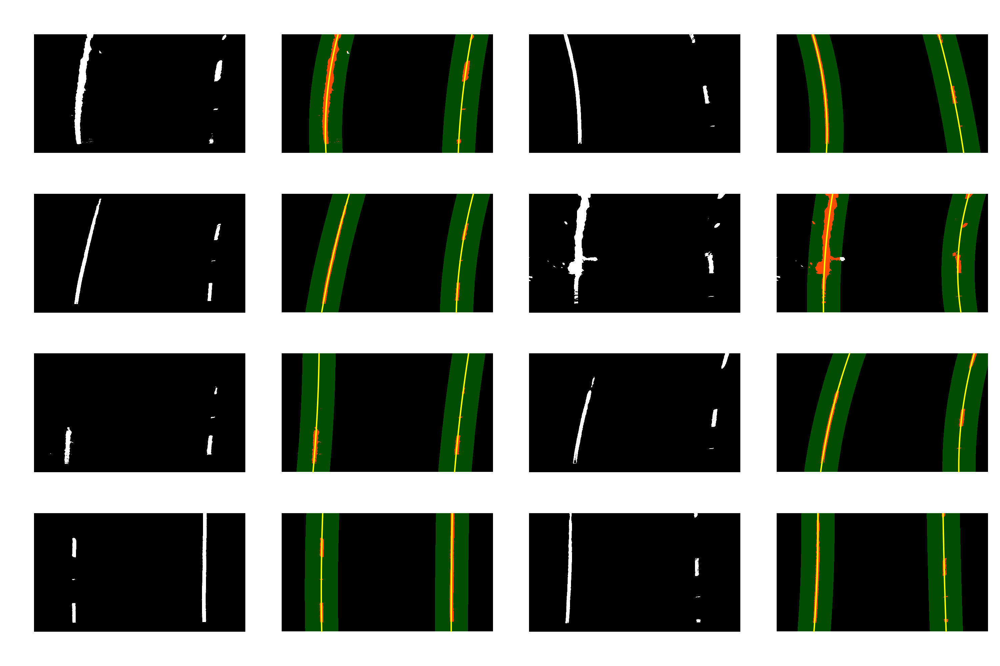
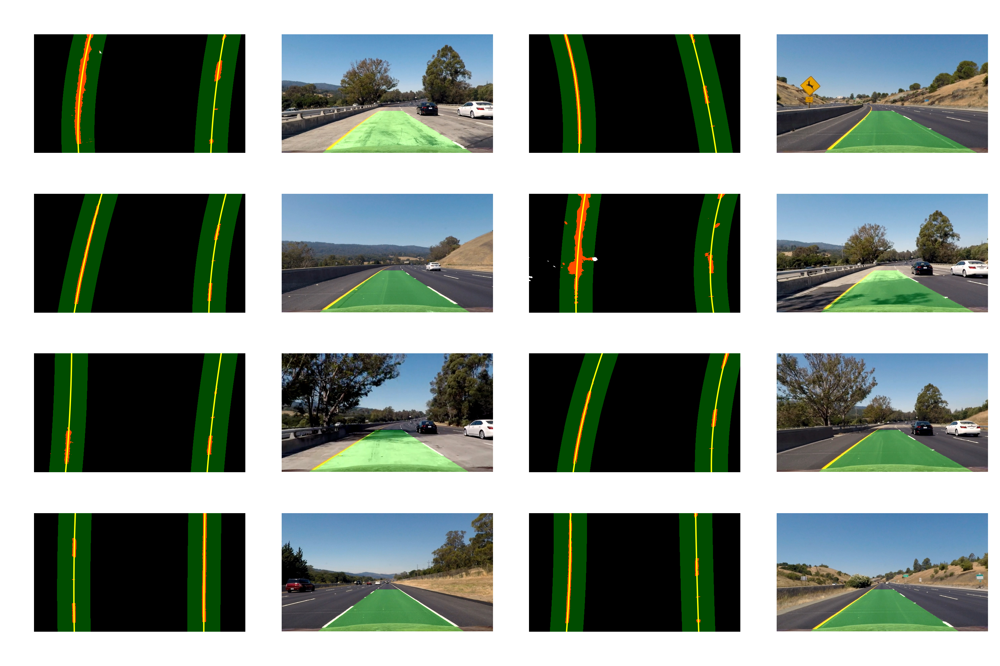

**Advanced Lane Finding Project**

The goals / steps of this project are the following:

* Compute the camera calibration matrix and distortion coefficients given a set of chessboard images.
* Apply a distortion correction to raw images.
* Use color transforms, gradients, etc., to create a thresholded binary image.
* Apply a perspective transform to rectify binary image ("birds-eye view").
* Detect lane pixels and fit to find the lane boundary.
* Determine the curvature of the lane and vehicle position with respect to center.
* Warp the detected lane boundaries back onto the original image.
* Output visual display of the lane boundaries and numerical estimation of lane curvature and vehicle position.

### Camera Calibration

The code for this step is contained in the function "undistort" lines 8 - 48 in the file adv_lane_lines.py. I start by preparing "object points", which will be the (x, y, z) coordinates of the chessboard corners in the world. Here I am assuming the chessboard is fixed on the (x, y) plane at z=0, such that the object points are the same for each calibration image.  Thus, `objp` is just a replicated array of coordinates, and `objpoints` will be appended with a copy of it every time I successfully detect all chessboard corners in a test image.  `imgpoints` will be appended with the (x, y) pixel position of each of the corners in the image plane with each successful chessboard detection.  

I then used the output `objpoints` and `imgpoints` to compute the camera calibration and distortion coefficients using the `cv2.calibrateCamera()` function.  I applied this distortion correction to the test image using the `cv2.undistort()` function and obtained this result: 

#### 2. Describe how (and identify where in your code) you performed a perspective transform and provide an example of a transformed image.

The code for my perspective transform includes a function called `warp()`, which appears in lines 90 through 100 in the file `adv_lane_lines.py`.  The `warp()` function takes as inputs an undistortet image (`img`) and transforms it to the perspective that I want to. The output for the test images looks as follows:

I used the following source and destination points:

| Source        | Destination   | 
|:-------------:|:-------------:| 
| 572, 465      | 170, 0        | 
| 712, 465      | 1030, 0       |
| 285, 670      | 170, 650      |
| 1030, 670     | 1030,650      |

#### 3. Describe how (and identify where in your code) you used color transforms, gradients or other methods to create a thresholded binary image.  Provide an example of a binary image result.

I used a combination of color and gradient thresholds to generate a binary image through my functions `hls_select`, `abs_sobel`, and `yw_combinator` from lines 61 to 127.  Here's an example of my output for this step.  

I basically combined different combinations of thresholds for the HSL color space tailored to detect yellow and white colors in into my variable combine_all to detect the binary image.

#### 4. Describe how (and identify where in your code) you identified lane-line pixels and fit their positions with a polynomial?

Then I used the find_lanes function in my program to detect lines in the program and fit polynomials to the detected lines. I used the sliding window based histogram approach first to identify the position of the lines in a 9 layer subsegmentation of the image and then used the `polyfit` functions to fit the polynomials to it. the output looked like this on the test images:

#### 5. Describe how (and identify where in your code) you calculated the radius of curvature of the lane and the position of the vehicle with respect to center.

I did this in lines 213 through 214 in my code in with the functions `get_curvature` and `get_offset`.

#### 6. Provide an example image of your result plotted back down onto the road such that the lane area is identified clearly.

I implemented this step in lines 244 through 261 in my code in adv_lane_lines in the function `project_back`.  Here is an example of my result on a test image:

---

### Pipeline (video)

Here's a [link to my video result](./test_out.mp4)

---

### Discussion

I think under more difficult conditions, shadows, and different color pavement my algorithm will probably run into troubles. 

